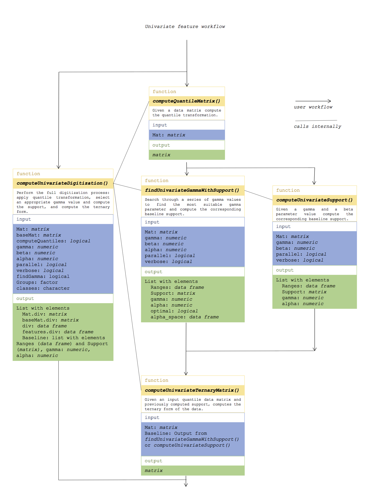
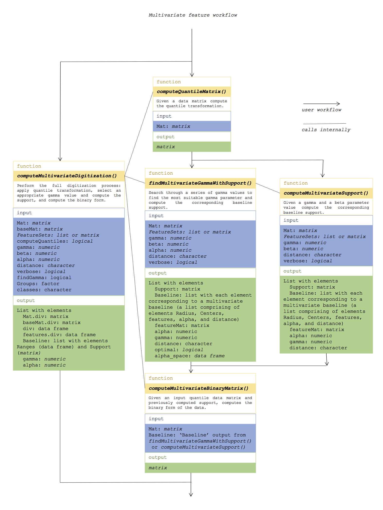

```{r, echo=FALSE, message=FALSE, warning=FALSE}

```

\section{Introduction}

Recently in [@dinalankara2018digitizing] we introduced divergence analysis, a framework for analysing high dimensional omics data. The principle behind this approach is to simulate a clinical test which tests for deviation from a normal profile as a marker of some abnormal condition. Given a matrix of high dimensional omics data (RNA-Seq expression, microarray expression, CpG level methylation, etc) where one group of samples are designated as the baseline cohort, the other sample profiles can be converted to a binary or ternary string indicating whether each omics feature of the sample is outside the baseline range or not. This can be performed at the individual feature level (in which case the result will be a string of 0, 1, and -1 indicating no divergence, deviation by being above the baseline range, and deviation by being below the baseline range, respectively), or it can be perfomed at the multivariate feature level. Multivariate features are sets of single features (e.g. a functional gene set) and if divergence analysis is performed at this level, the result will be binary (0 indicating no deviation, 1 indicating deviation). 

As we will see, the method is simple to work with. The method applies no special normalization procedures other than a sample specific quantile transformation which is applied to each sample before baseline computation and divergence coding. There are two paramters, $\gamma$ and $\beta$ that can be tuned during baseline computation. For more information about how the method works, see [@dinalankara2018digitizing].

The package contains a small data set, which we will use here to demonstrate the workflow. The fololowing objects are included in the package:

* \textit{breastTCGA\_Mat}: This is a matrix of 260 genes and 887 samples of breast RNA-Seq data selected from the TCGA breast cancer cohort[@tcga]. The samples contain normals and primary tumors of both ER positive and negative subtypes. The values are gene level expression estimates in TPM (transcripts per million) format.

* \textit{breastTCGA\_Group}: This is a factor indicating whether each of the 887 samples mentioned above are normal or tumor. 

* \textit{breastTCGA\_ER}: This is a factor indicating whether the tumor samples are ER positive or ER negative.

* \textit{msigdb\_Hallmarks}: This is a list of 10 gene sets, a subset of the hallmark functional get set collection from the MSigDB database[@liberzon2011molecular]. We will use these 10 gene sets to demonstrate the multivariate divergence workflow.

We will use these objects throughout the following sections.

\section{Prepare Data}

The data preparation step is fairly straightforward, and involves deciding which samples will be used as the baseline, and which samples will be used as the main data that will be converted to the divergence form. 

We will use the normal samples from the brest TCGA data set as our baseline cohort, and the tumor samples will be digitized with respect to this normal baseline. 

We can prepare the baseline and data matrices, though this is strictly not necessary (as any preparations can be done on-the-fly as they are submitted to the functions). You may perform any other pre-processing or normalizing steps you would like to the data if deemed necessary depending on the experiment.

```{r, echo=TRUE}

# load divergence package
library(divergence)

# baseline cohort
mat.base = breastTCGA_Mat[, which(breastTCGA_Group == "NORMAL")]

# data conort
mat.data = breastTCGA_Mat[, which(breastTCGA_Group == "TUMOR")]

```


\section{Univariate Divergence}

Figure 1 shows the univariate workflow. As shown in the figure, there are three alternative routes the user can take. On one hand, the user can use the computeQuantileMatrix() function to convert the data (both the baseline data and the data to be digitized) to quantile form, and then use the computeUnivariateSupport() function to compute the baseline support if the $\gamma$ paramter (labeled 'gamma' in the package functions) to use is already known, or alternatively findUnivariateGammaWithSupport() function can be used to compute the baseline which will select the best $\gamma$ value from a given list. Then the computeUnivariateTernaryMatrix() function can be used to digitize the data with the baseline computed in this manner. 

Or more simply, the user can use the computeUnivariateDigitization() function and supply the baseline data and the data to be digitized, and this function will perform the quantile transformation and the $\gamma$ search and perform the digitization.




To demonstrate, we start by applying the quantile transformation to our prepared baseline reference samples and our data samples. This is performed using the computeQuantileMatrix() function which takes a data matrix as input and outputs a data matrix of the same dimensions with each sample converted to a quantile. However, since the quantile transformation is a sample-wise operation you can supply one sample at a time if needed - i.e. it is not necessary to have all the required data in your analysis beforehand.

```{r, echo=TRUE}

# convert normal data to quantiles
mat.base.q = computeQuantileMatrix(mat.base)
# view
mat.base.q[1:5, 1:4]

# convert tumor data to quantiles
mat.data.q = computeQuantileMatrix(mat.data)
# view
mat.data.q[1:5, 1:4]

```

Now we can compute the support using the quantile-form normal data. There are two functions provided for this, for two scenarios. The first is computeUnivariateSupport(), which can be used to compute the support if the $\gamma$ and $\beta$ parameters have already been decided by the user. For example, let us suppose we have decided to use $\gamma = 0.1$ and $\beta = 0.99$. The $\gamma$ parameter controls the radius of the ball around each baseline sample, which in the univariate scenario becomes the distance to a certain nearest neighbour. The larger the $\gamma$ value, the farther the neighbour will be. Since $\beta = 0.99$, $99\%$ of the reference samples will be included in the support.

```{r, echo=TRUE}

baseline1 = computeUnivariateSupport(
  Mat=mat.base.q, 
  gamma=0.1, 
  beta=0.99, 
  parallel=FALSE
)

```

If the baseline data is larger, you can set the parallel option to TRUE which will use the mclapply function of the parallel package (if available) to run the computation parallelly. 

The function returns a list containing the support information: a data frame Ranges containing the support (which is an interval in the univariate scenario), a matrix Support which indicates whether each sample was included in the support of each feature or not, and gamma and alpha values, where alpha is the average number of features divergent per sample. The Support matrix is a binary matrix, where if a sample is included in the support of a given feature it has a value of 1 and 0 otherwise.

```{r, echo=TRUE}

head(baseline1$Ranges)

baseline1$Support[1:5, 1:4]

baseline1$alpha

```

However, more often is general usage there will be no pre-determined gamma value to be used. Rather, we would like to limit the divergence of the baseline data lower than a certain threshold. The findUnivariateGammaWithSupport() function can be used in this case, which allows the user to provide a range of candidate gamma parameter values along with a beta value, and a thrshold alpha for the expected divergent number of features per sample. The function will search through the given gamma values in asending order until the expected divergent number of features per sample falls below the given alpha threshold, and select that gamma value.

The following will find a support such that the expected number of divergence features per sample is less than 0.5\% in the baseline cohort:

```{r, echo=TRUE}

baseline2 = findUnivariateGammaWithSupport(
  Mat=mat.base.q, 
  gamma=1:9/10, 
  beta=0.9, 
  alpha=0.005,
  parallel=FALSE
)

```

The computed baseline has various information on the paramters you can check:

```{r, echo=TRUE}

# selected gamma
baseline2$gamma

# alpha value: i.e. number of divergent features per sample in the baseliine cohort
baseline2$alpha

# does the selected gamma meet the alpha threshold required by the user?
baseline2$optimal

# view the alpha values obtained for each of the gamma values searched through
baseline2$alpha_space

```

Similar to the output from the computeUnivariateSupport() function, for the selected gamma you can obtain the Ranges data frame and Support matrix which respectively provides the feature level baseline intervals and indication of which samples are contained in each feature support.

```{r, echo=TRUE}

head(baseline2$Ranges)

```

Now we can covert the tumor data to ternary form using the baseline:

```{r, echo=TRUE}

mat.div.1 = computeUnivariateTernaryMatrix(
  Mat = mat.data.q,
  Baseline = baseline2
)

mat.div.1[1:5, 1:4]

```

The simpler approach is to use the computeUnivariateDigitization() function, which will perform all of the above steps:

```{r, echo=TRUE}

div.2 = computeUnivariateDigitization(
  Mat = mat.data,
  baseMat = mat.base,
  computeQuantiles = TRUE,
  gamma = 1:9/10,
  beta = 0.9,
  alpha = 0.01, 
  parallel = FALSE
)

# digitized data matrix
dim(div.2$Mat.div)
div.2$Mat.div[1:5, 1:4]

# digitized baseline matrix
dim(div.2$baseMat.div)
div.2$baseMat.div[1:5, 1:4]

# divergent set size in each data matrix sample
head(div.2$div)

# divergence probability of features
head(div.2$features.div)

# baseline information
head(div.2$Baseline$Ranges)
div.2$Baseline$gamma

```

If a phenotype of interest is available for the data, that can be supplied as an optional parameter to the computeUnivariateDigitization() function which will then also include the feature level divergent probabilities for each group:

```{r, echo=TRUE}

# make a factor of the ER status phenotype
selection = which(colnames(breastTCGA_Mat) %in% colnames(mat.data))
groups.ER = breastTCGA_ER[selection]

table(groups.ER, useNA='i')

# perform divergence
div.3 = computeUnivariateDigitization(
  Mat = mat.data.q,
  baseMat = mat.base.q,
  computeQuantiles = FALSE,
  gamma = 1:9/10,
  Groups = groups.ER, 
  classes = c("Positive", "Negative"),
  parallel = FALSE
)

# divergence probability of features
head(div.3$features.div)

```

\section{Finding differentially divergent features}

The package includes a computeChiSquaredTest() function which will apply the chisq.test() function provided in the stats package to each feature and over a given sample grouping and two classes to discriminted against. This can be used to identify features that are highly differentially divergent in the digitized form between two phenotypes. The output data frame will contain the $\chi^2$-test statistic and p-value for each feature sorted by p-value:

```{r, echo=TRUE, warning=FALSE}

chi.1 = computeChiSquaredTest(
  Mat = div.3$Mat.div,
  Groups = groups.ER,
  classes = c("Positive", "Negative")
)

head(chi.1, 10)

```


\section{Multivariate Divergence}



In this section we look at how to perform divergence analysis on multivariate features - i.e. sets of features. We use the hallmark gene sets mentioned previously to demonstrate this. As shown in figure 2, the workflow is similar to the univariate case, with the main difference being that the multivariate features need to be provided as input in each step. 

```{r, echo=TRUE}

length(msigdb_Hallmarks)

lapply(msigdb_Hallmarks[1:3], head)

```

Starting with the quantile transformed data, we can use the computeMultivariateSupport() function to compute a multivariate baseliine if we already know which gamma prameter we would like to use.

```{r, echo=TRUE}

baseline3 = computeMultivariateSupport(
  Mat=mat.base.q, 
  FeatureSets = msigdb_Hallmarks,
  gamma=0.1, 
  beta=0.99
)

```

Or, we use the findMultivariateGammaWithSupport() to search through a given list of gamma values to find the best baseline that meets a given alpha threshold:

```{r, echo=TRUE}

baseline4 = findMultivariateGammaWithSupport(
  Mat=mat.base.q, 
  FeatureSets = msigdb_Hallmarks,
  gamma=1:9/10, 
  beta=0.9,
  alpha = .01
)

# selected gamma
baseline4$gamma

# alpha value: i.e. number of divergent multivariate features per sample in the baseliine cohort
baseline4$alpha

# does the selected gamma meet the alpha threshold required by the user?
baseline4$optimal

# view the alpha values obtained for each of the gamma values searched through
baseline4$alpha_space

```

Once the baseline has been computed, the binary digitized form can now be computed for the data matrix:

```{r, echo=TRUE}

mat.div.2 = computeMultivariateBinaryMatrix(
  Mat = mat.data.q,
  Baseline = baseline4
)

dim(mat.div.2)

mat.div.2[1:5, 1:4]

```

As the the univariate case, all the steps can be performed together simply by using the computeMultivariateDigitization function. We use the ER status phenotype here as well, to obtain phenotype specific divergence probabilities for each gene set.

```{r, echo=TRUE}

# perform divergence
div.4 = computeMultivariateDigitization(
  Mat = mat.data,
  baseMat = mat.base,
  FeatureSets = msigdb_Hallmarks,
  computeQuantiles = TRUE,
  gamma = 1:9/10,
  Groups = groups.ER, 
  classes = c("Positive", "Negative")
)

# digitized data matrix
dim(div.4$Mat.div)
div.4$Mat.div[1:5, 1:4]

# digitized baseline matrix
dim(div.4$baseMat.div)
div.4$baseMat.div[1:5, 1:4]

# divergent set size in each data matrix sample
head(div.4$div)

# divergence probability of features
head(div.4$features.div)

# baseline information
div.2$Baseline$gamma
div.2$Baseline$alpha
div.2$Baseline$optimal
div.2$Baseline$alpha_space

```

$\chi^2$-Tests can be applied on the multivariate digitized data to find differentially divergent gene sets:

```{r, echo=TRUE, warning=FALSE}

chi.2 = computeChiSquaredTest(
  Mat = div.4$Mat.div,
  Groups = groups.ER,
  classes = c("Positive", "Negative")
)

head(chi.2, 10)

```

\section{Summary}

The above workflows provide a concise summary of how to work with the package. Mainly, the user can use the computeUnivariateDigitization() and computeMultivariateDigitization() functions to obtain the divergence coding given a baseline data matrix and a main experimental data matrix. Otherwise, there are other functions for working at both the univariate and multivariate level for a more step by step approach to performing divergence analysis.

\section{Session Information}

```{r, echo=TRUE, warning=FALSE}

sessionInfo()

```

\section{References}


